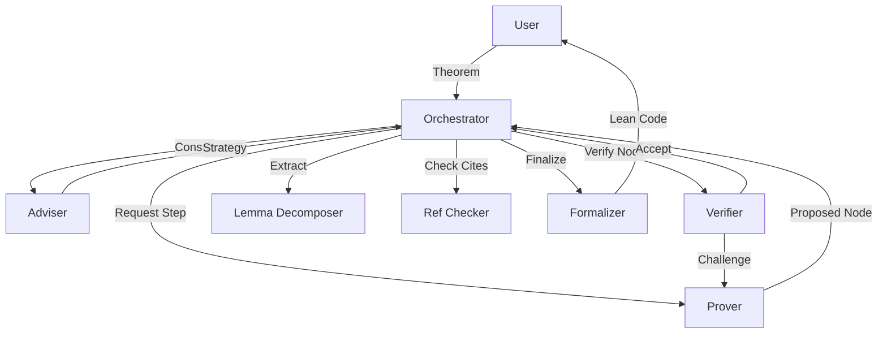

# Architecture & Concepts

Alethfeld is not a single "AI Mathematician." It is a coordinated system of specialized agents working in an adversarial loop to produce high-quality proofs.

## The Core Philosophy

1.  **Structured Notation**: Free-form text is ambiguous. Alethfeld uses Leslie Lamport's hierarchical proof style to force explicit dependencies and scope.
2.  **Adversarial Verification**: A proof is not accepted because it looks good; it is accepted only if an adversarial "Verifier" agent fails to find a flaw.
3.  **Traceability**: Every claim must stem from axioms, definitions, or citations. There is no "it is well known."

## The Agent Swarm

The system is coordinated by an **Orchestrator** which manages the state (the Semantic Graph) and delegates tasks to sub-agents.

### 1. The Adviser
*   **Role**: Strategic guidance.
*   **Input**: The theorem statement and current graph state.
*   **Output**: High-level approach, identification of doomed strategies, and diagnosis when the Prover gets stuck.
*   **Analogy**: A thesis advisor who guides the research direction but doesn't write the proofs.

### 2. The Prover
*   **Role**: Generating proof steps.
*   **Input**: The current context and a goal.
*   **Output**: A proposed "Graph Delta" (new nodes, edges, or revisions).
*   **Behavior**: Writes in Lamport structure, referencing specific prior nodes.

### 3. The Verifier
*   **Role**: Adversarial checking.
*   **Input**: A single proposed step and its dependencies.
*   **Output**: `ACCEPT` or `CHALLENGE` (with a specific reason).
*   **Behavior**: Assumes the Prover is wrong. Checks for logical gaps, hidden quantifiers, and type errors.

### 4. The Lemma Decomposer
*   **Role**: Modularization.
*   **Input**: The growing proof graph.
*   **Output**: Suggestions for subgraphs that can be extracted into independent lemmas.
*   **Goal**: Keeps the context window manageable and the proof modular.

### 5. The Reference Checker
*   **Role**: Fact-checking.
*   **Input**: Citations (DOI, arXiv ID) and claimed statements.
*   **Output**: Verification status (`verified`, `mismatch`, `not-found`).
*   **Mechanism**: Uses web search to validate that cited papers actually exist and support the claim.

### 6. The Formalizer
*   **Role**: Translation.
*   **Input**: The verified semantic graph.
*   **Output**: Lean 4 code.
*   **Goal**: Converts the EDN graph into a compilable Lean skeleton, using `sorry` for proofs but capturing the structure and types.

## The Workflow



1.  **Initialization**: The graph is initialized with the Theorem and extracted Assumptions.
2.  **Strategy**: The Adviser suggests a proof path (e.g., "Use induction on n", "Expand definitions via Bloch sphere").
3.  **Expansion Loop**:
    *   Prover proposes steps.
    *   Verifier checks them.
    *   If rejected, Prover revises.
    *   If accepted, they become part of the graph.
4.  **Maintenance**: The Lemma Decomposer watches for opportunities to clean up the graph.
5.  **Finalization**: Once the theorem is reached (QED), the Reference Checker validates sources, and the Formalizer generates the Lean artifacts.

## The CLI Tool

All graph mutations go through the `alethfeld` CLI, ensuring consistent validation and taint propagation.

```bash
cd alethfeld
./scripts/alethfeld <command> [options]
```

**Key commands:**
- `init` - Create new graph from theorem
- `add-node` - Add nodes (claims, assumptions, definitions)
- `update-status` - Mark nodes as verified/rejected/admitted
- `replace-node` - Replace rejected nodes with revisions
- `extract-lemma` - Extract verified subgraphs as lemmas
- `validate` - Check graph integrity

See [CLI Reference](cli-reference.md) for complete documentation.
